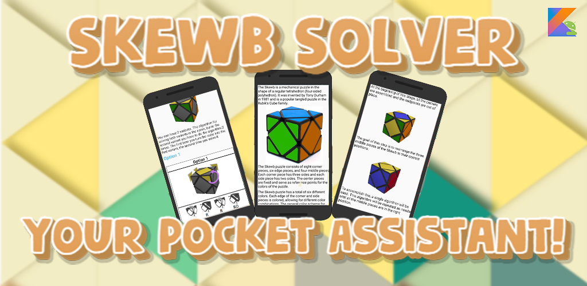
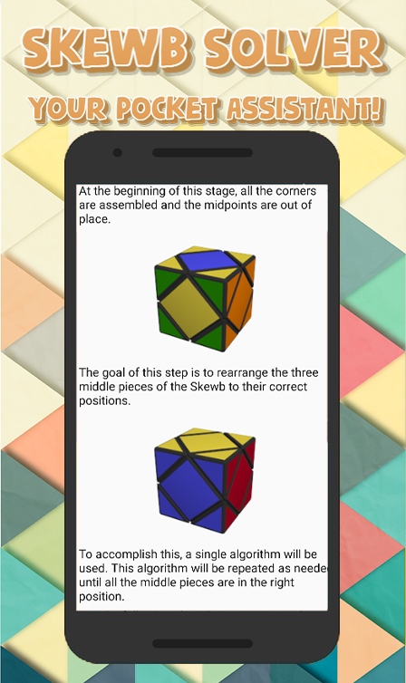
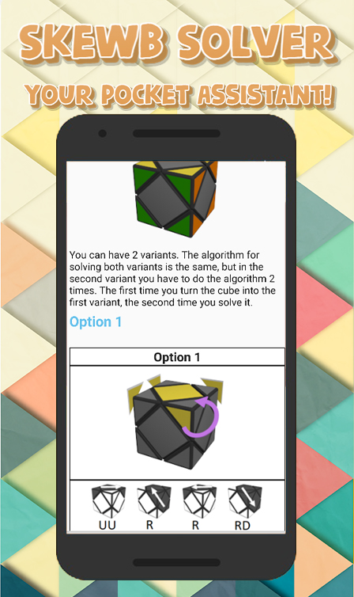
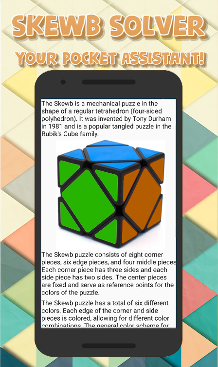

<h1 align="center"> SkewbSolverAndroidKotlin
 - A pocket guide to solving Skewb puzzle for Android devices developed in IDE Android Studio</h1>

## Description

Skewb Solver: Your pocket Skewb puzzle assistant!

Ready to solve the Skewb puzzle and impress your friends? Look no further! Skewb Solver is the ultimate companion for solving the challenging Skewb puzzle on your Android device.

This comprehensive app provides step-by-step instructions, detailed descriptions, and visual aids to guide you through the assembly process. With animated GIF images and informative pictures, you'll have a clear understanding of each move and algorithm.

Skewb Solver is designed to run on devices running the Android operating system version 4.4.2 (KitKat) and higher, written exclusively in Kotlin.

This mobile application is published in Google Play Market and is available for download at the link. <a href="https://play.google.com/store/apps/details?id=com.anatoliyvinokurov.skewbsolver">link on Google Play Market</a>
<a href="https://play.google.com/store/apps/dev?id=7939525547152270598">My developer page in Google Play Market</a>

## Features include:

Step-by-step instructions: The app provides detailed instructions broken down into easy-to-follow steps, ensuring a seamless solving experience.

Clear descriptions: Each step is described in detail, leaving no room for confusion.

Visual aids: Visual learners will appreciate the animated GIF images and helpful pictures that demonstrate the moves and algorithms.
Variant Solutions: Run into different puzzle configurations? Skewb Solver has you covered with alternative solutions for different scenarios.

Repeatable steps: Some steps may need to be repeated several times. The application emphasizes when and how to repeat certain algorithms until the desired result is achieved.

Offline accessibility: Once downloaded, the app can be accessed offline, allowing you to solve the Skewb puzzle anytime, anywhere.
Whether you're a beginner or an advanced puzzle solver, Skewb Solver is designed to improve your solving skills and help you master the Skewb puzzle with ease. Impress your friends with your solving speed and become a Skewb solving pro!

Download Skewb Solver now and embark on an exciting puzzle solving journey!

### Pictures

## Project setup

import this project to Android Studio

## Future scope

- Add translations to other languages.